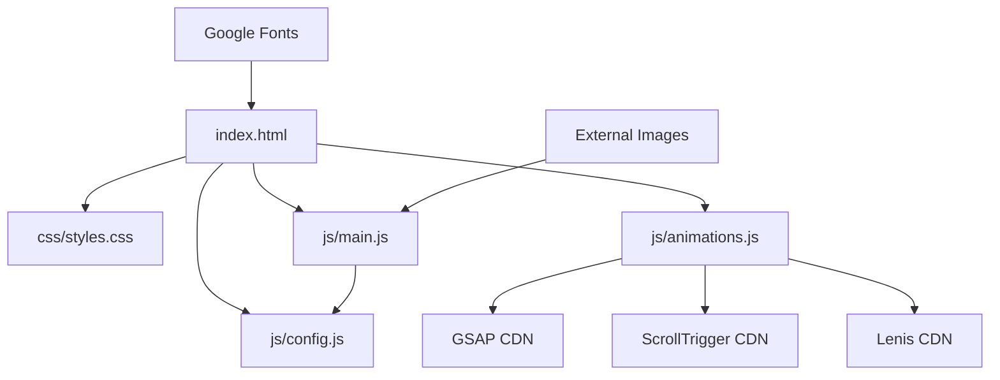

# File Directory Structure

This document outlines the complete file structure of the Moses Harding portfolio website and the purpose of each file.

## Root Directory Structure

```
Mosesharding.com/
├── css/
│   └── styles.css              # Main stylesheet with theme system and responsive design
├── js/
│   ├── animations.js           # GSAP animations, Lenis smooth scroll, preloader
│   ├── config.js               # Site configuration and content management
│   └── main.js                 # Main JavaScript functionality and interactions
├── Documentation/
│   └── Architecture/           # This architecture documentation
├── .claude/                    # Claude Code configuration (optional)
├── .git/                       # Git version control
└── index.html                  # Main HTML file and site entry point
```

## File Details

### Core Files

#### `index.html`
- **Purpose**: Main HTML structure and semantic markup for the entire website
- **Key Sections**:
  - Header with navigation and theme toggle
  - Hero section with introduction
  - Apps portfolio section (dynamically populated)
  - About section
  - Contact section (dynamically populated)
  - Footer
- **Features**:
  - SEO optimized with meta tags
  - Open Graph tags for social sharing
  - Semantic HTML5 structure
  - Accessibility attributes (ARIA labels)
  - Preloads critical resources

#### `css/styles.css`
- **Purpose**: Complete styling system with built-in dark/light theme support
- **Key Components**:
  - CSS Custom Properties (variables) for theming
  - Responsive design with mobile-first approach
  - Animation system with reduced motion support
  - Component-specific styles
  - Grid and flexbox layouts
- **Features**:
  - Theme system with CSS variables
  - Smooth transitions and animations
  - Mobile-responsive breakpoints
  - Print-friendly styles
  - Accessibility considerations

#### `js/config.js`
- **Purpose**: Centralized configuration for all site content
- **Managed Content**:
  - Personal information (name, title, location)
  - Contact details and social links
  - Hero section content
  - About section paragraphs
  - App portfolio entries with full details
  - Footer copyright text
- **Benefits**:
  - Easy content updates without touching HTML
  - Consistent data structure
  - Scalable for adding new apps
  - Single source of truth for content

#### `js/main.js`
- **Purpose**: Interactive functionality and dynamic content rendering
- **Key Features**:
  - Theme switching with system preference detection
  - Dynamic app card generation from config (supports multiple screenshots)
  - Dynamic contact link generation
  - Scroll animations and reveal effects
  - Smooth scrolling navigation
  - Active navigation state management
  - Keyboard navigation support
  - Performance optimizations

#### `js/animations.js`
- **Purpose**: Advanced animations using GSAP and Lenis libraries
- **Key Features**:
  - Lenis smooth scroll initialization with GSAP integration
  - Preloader animation with SVG path drawing
  - Hero section parallax effects
  - Scroll-triggered reveal animations
  - Text split and reveal animations
  - Parallax background effects
  - Magnetic navigation link effects
- **Dependencies**:
  - GSAP (GreenSock Animation Platform)
  - GSAP ScrollTrigger plugin
  - Lenis smooth scroll library

### Directory-Specific Details

#### `css/` Directory
- Contains only the main stylesheet to minimize HTTP requests
- Uses CSS custom properties for maintainability
- Implements mobile-first responsive design
- Includes animation keyframes and transitions

#### `js/` Directory
- **animations.js**: GSAP + Lenis animation system
- **config.js**: Pure data configuration, no logic
- **main.js**: Core interactive functionality and dynamic content
- External dependencies: GSAP, ScrollTrigger, Lenis (loaded via CDN)
- Modular function organization
- Performance-focused with event delegation

#### `Documentation/` Directory
- **Architecture/**: System design documentation
- Contains detailed technical documentation
- Helpful for future maintenance and development
- Includes comprehensive feature catalog

## File Dependencies



## Loading Order

1. **Critical CSS** - Loaded in `<head>` for immediate styling
2. **Config Script** - Loaded before body for immediate access
3. **Main Script** - Loaded at end of body for performance
4. **External Resources** - Loaded with appropriate hints (preconnect, preload)

## Asset Management

### Images
- App icons loaded from external URLs (App Store)
- Placeholder system for missing assets
- SVG icons embedded inline for performance
- Optimized loading with lazy attributes where applicable

### Fonts
- Inter font family from Google Fonts
- Preconnect hints for performance
- Fallback system fonts defined

## Performance Considerations

- Minimal HTTP requests (combined CSS)
- No framework dependencies
- Efficient event delegation
- RequestAnimationFrame for scroll animations
- Intersection Observer for reveal animations
- CSS transitions over JavaScript animations
- Optimized images with proper sizing

## Maintenance Notes

### Adding New Apps
1. Update `js/config.js` apps array
2. Add app icon URL or use placeholder system
3. Include feature list and description
4. Set App Store URL when available

### Updating Content
1. Edit `js/config.js` for text content
2. Modify `css/styles.css` for visual changes
3. Update `index.html` for structural changes

### Adding New Sections
1. Add HTML structure to `index.html`
2. Create corresponding CSS in `styles.css`
3. Add JavaScript functionality in `main.js` if needed
4. Update config if section uses dynamic content