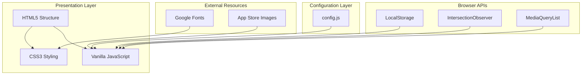

# High-Level Architecture

This document describes the overall system design, architectural patterns, and key principles used in the Moses Harding portfolio website.

## System Overview

The portfolio is a static website built with vanilla HTML5, CSS3, and JavaScript, following a component-based architecture with a focus on performance, accessibility, and maintainability.



## Architectural Principles

### 1. Progressive Enhancement
- Base functionality works without JavaScript
- Enhanced experience with JavaScript enabled
- Graceful degradation for older browsers
- Core content always accessible

### 2. Mobile-First Design
- Styles built for mobile screens first
- Progressive enhancement for larger screens
- Touch-friendly interface elements
- Optimized performance for mobile devices

### 3. Performance Optimization
- Zero external JavaScript dependencies
- Minimal HTTP requests
- Efficient animation using CSS transforms
- Lazy loading and intersection observers
- RequestAnimationFrame for scroll events

### 4. Accessibility First
- Semantic HTML5 structure
- ARIA labels where needed
- Keyboard navigation support
- Screen reader compatible
- Respect for prefers-reduced-motion

## Core Architecture Patterns

### Configuration-Driven Content
```
Data Layer (config.js)
    ↓
Rendering Layer (main.js)
    ↓
Presentation Layer (DOM)
```

The site uses a centralized configuration pattern where:
- All content is stored in `config.js`
- JavaScript dynamically renders content
- No hardcoded content in HTML
- Easy to update and maintain

### Theme System Architecture
```
CSS Variables
    ↓
Theme Classes
    ↓
JavaScript Theme Manager
    ↓
User Preferences + System Detection
```

The theme system implements:
- CSS custom properties for all colors
- Data attributes for theme switching
- LocalStorage for persistence
- System preference detection
- Smooth theme transitions

### Component-Based Structure
Each section of the site is treated as an independent component:
- **Header Component**: Navigation and theme toggle
- **Hero Component**: Introduction and CTAs
- **Apps Component**: Dynamic portfolio grid
- **About Component**: Personal information
- **Contact Component**: Dynamic contact links
- **Footer Component**: Copyright and links

## State Management

### Theme State
```javascript
{
    currentTheme: 'light' | 'dark',
    systemPreference: 'light' | 'dark',
    userOverride: boolean
}
```

### UI State
```javascript
{
    scrolledHeader: boolean,
    activeSection: string,
    animatedElements: Set<Element>,
    mouseX: number,
    mouseY: number
}
```

### Configuration State
```javascript
{
    personalInfo: Object,
    apps: Array<AppData>,
    contactLinks: Array<LinkData>,
    siteContent: Object
}
```

## Animation Architecture

### Scroll-Based Animations
- Uses `IntersectionObserver` for performance
- Staggered animations with CSS classes
- Respects `prefers-reduced-motion`
- One-time animations (unobserve after trigger)

### Interactive Animations
- CSS transitions for state changes
- JavaScript for complex interactions
- GPU-accelerated transforms
- 60fps target with requestAnimationFrame

## Performance Optimization Strategies

### Critical Rendering Path
1. Inline critical CSS for above-the-fold content
2. Defer non-critical CSS loading
3. Load JavaScript after DOM
4. Optimize font loading with preconnect

### Animation Performance
- Use `transform` and `opacity` for animations
- Avoid layout thrashing
- Batch DOM reads/writes
- Use will-change property sparingly

### Memory Management
- Unobserve elements after animation
- Clean up event listeners
- Use event delegation for dynamic content
- Avoid memory leaks in closures

## Security Considerations

### Content Security
- No server-side processing
- No user input storage
- External resources from trusted sources
- Sanitized external links with `rel="noopener"`

### Data Protection
- No personal data collection
- LocalStorage only for theme preference
- No analytics or tracking
- GDPR compliant by design

## Browser Compatibility

### Supported Browsers
- Chrome 60+
- Firefox 55+
- Safari 12+
- Edge 79+

### Fallback Strategies
- CSS Grid with Flexbox fallback
- Custom Properties with static fallbacks
- IntersectionObserver with scroll fallback
- ES6+ with optional chaining checks

## Scalability Architecture

### Adding New Features
1. Update configuration schema in `config.js`
2. Add rendering logic to `main.js`
3. Style components in `styles.css`
4. Update HTML structure if needed

### Content Management
- Centralized in configuration
- Type-safe data structures
- Validation through documentation
- Version control friendly

### Code Organization
- Modular JavaScript functions
- CSS organized by component
- Clear naming conventions
- Comprehensive documentation

## Deployment Architecture

### Static Site Hosting
- No server requirements
- CDN-friendly structure
- Instant deployment
- Global scalability

### Build Process
- Zero-build requirements
- Files served as-is
- Optional minification step
- Gzip compression on server

## Future Extensibility

The architecture supports:
- Addition of new sections
- CMS integration via API
- Multi-language support
- Advanced animations
- Progressive Web App features
- Server-side rendering (if needed)

## Testing Strategy

### Manual Testing Checklist
- Theme switching functionality
- Responsive design breakpoints
- Keyboard navigation
- Screen reader compatibility
- Performance metrics
- Cross-browser compatibility

### Automated Opportunities
- Lighthouse CI integration
- Visual regression testing
- Accessibility audit automation
- Performance monitoring